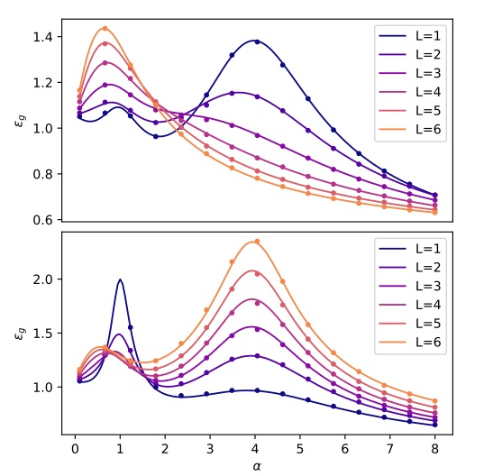

# dRF

Code for the paper : <i>Deterministic equivalent and error universality of deep random features learning</i> (<a href="https://proceedings.mlr.press/v202/schroder23a.html">link to paper</a>)

<p align="center"></center></p>

## Ridge regression
(Fig. 1)
- <tt>Ridge.ipynb</tt> provides a Jupyter notebook implementation of the theoretical characterization of Appendix D.2 for the test error $\epsilon_g$, achieved by a depth $L=2$ dRF,
with $\sigma=\tanh$ activation, and a single-layer target $L_\star=1,\sigma_\star=$ sign. To vary the length, the coefficients $r_\ell, \kappa^\ell_1,\kappa^\ell_*$ (10-11) must be first evaluated.

## Logistic regression
(Fig. 2)
- <tt>Logistic.ipynb</tt> provides a Jupyter notebook implementation of the theoretical characterization of Appendix D.3 for the classification error $\epsilon_g$, achieved by a depth $L=2$ dRF,
with $\sigma=\tanh$ activation, and a single-layer target $L_\star=1,\sigma_\star=$ sign. To vary the length, the coefficients $r_\ell, \kappa^\ell_1,\kappa^\ell_*$ (10-11) must be first evaluated.

## Varying the depth
(Fig. 3)
-<tt>Layerwise_ridge.ipynb</tt> reproduces Fig. 3, namely the test error of various dRF of increasing depth $L$. For instance, to plot the test erros up to depth $10$
models, run
```
max_length=10
for L in errors.keys():
    plt.plot(alphas, errors[L],label="layer "+str(L),linewidth=1.3) 
```


<b> Versions:</b> These notebooks employ <tt>Python 3.12 </tt>.
